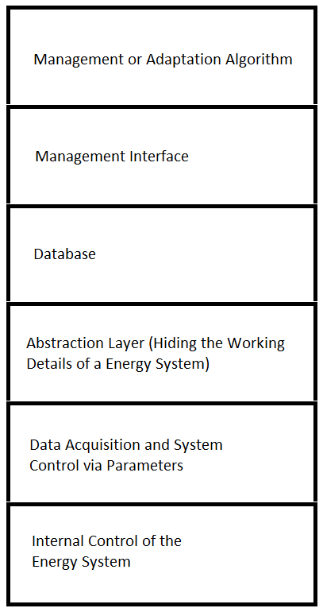
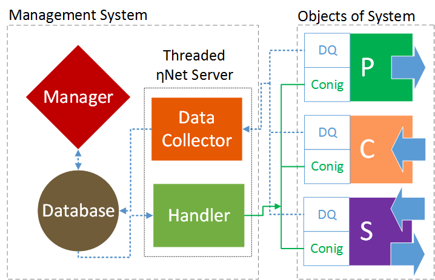
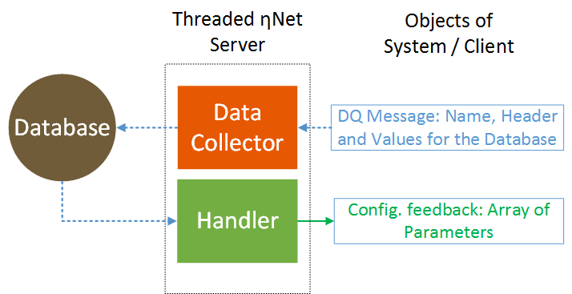

# EtaNetPythonClients
## Clients infrastructure for the ηNet energy management system (Python 3)

### Context of the development
Within the framework of the energy management project ηNet a cyber-physical system was developed which enables the energetic analysis and control of energy systems. Based on the energy flows, the operating conditions of the individual systems are determined and modified with the help of a management algorithm. For this project a Raspberry PI 3 (Rasbian) was used to collect and modify data on energy flows. 

  
### UML-Class Diagram of Python-Client Application
The diagram is created with [Violet UML Editor](http://alexdp.free.fr/violetumleditor/page.php) and can also be viewed via a browser. Details have been omitted for a better overview.


## Concept of Energy Management System
The aim is to establish a management layer that has an influence on the control of the energy system. In this way, higher adaptation strategies can be implemented.



Figure1: Layered representation of the abstraction. 

For digitization, all field elements of the energy system are classified into three classes: producers, consumers and storages. Each real element is understood as a cyber-physical object (CPO) of these classes. This CPOs carry all values to fully describe and control the field elements of the energy system and serve as an interface for external applications. The real CPOs are generated by a single on-board computer on which the client software for the ηNet network also runs. Together with the ηNet-servers, it is possible to easily create a network with CPOs to collect all data and control the entire plant together with a database. Due to the CPOs, the management system knows all about existing system components and the networking. This knowledge base is used for plant-specific optimization or adaptation algorithms. For example, to minimize costs or CO2 emissions. This enables higher control strategies and data managed systems. 



Figure2: Schematic representation of the system architecture concept. Producer (P), Consumer (C), Storage (S), Data Acquisition (DQ), Controlling and Configuration (Conig). The big blue arrows indicate the direction of the energy flows.



Figure3: Schematic representation of the server workflow. 

## ηNet - Communication Protocol 

The clients can send a message at any time. No message is lost, because the server processes more or less in parallel all messages in a mulitaskting process.  The server is programmed so that only the communication line, the hardware of the computer and the database query limit the data traffic. 

### Data structure the server expects from the client:
```
"'NameOfClient' ( 'DBHeader 1', 'DBHeader 2', ..., 'DBHeader n') VALUES (value 1, value 2, ..., value n)"
If one of the values is a string then it should be quoted ( 'value 1' ).
```

Example:
```
"'CHP- SenerTec Dachs G5.52' ('Time Stamp - Heat Meter 1', 'Th. Power [W] - Heat Meter 1', 'Water Flow [m^3/h] - Heat Meter 1', 'T_Flow [°C] - Heat Meter 1', 'T_Return [°C] - Heat Meter 1', 'Time Stamp - Heat Meter 2', 'Th. Power [W] - Heat Meter 2', 'Water Flow [m^3/h] - Heat Meter 2', 'T_Flow [°C] - Heat Meter 2', 'T_Return [°C] - Heat Meter 2') VALUES ('2018-12-22 14:09:36', 12000.2, 12.1258, 22.14, 22.44, '2018-12-11 14:09:36', 12000.1, 11.1258, 21.14, 21.44)";
```
### Data structure the client expects from the server:
When the client sends measurement data or an 'E5', the server first checks whether any of the control data has changed. If none of the data has changed compared to the last call, the server sends back an 'E5' immediately afterwards. However, if one of the control data in the database has changed, the server returns the current set of control data from the client. 
The control data has the same data structure for each client. I.e. the headers in the database are the same for each client. While the client always sends the headers together with the measurement data, the server only sends an array of values to the client.
```
"'ControlMatrix' ('Object Name',  'Activity (on / off)', 'Prioritization', 'El. Power Limitation', 'Th. Power Limitation', 'Release Time', 'Operating Mode') VALUES ('Name of Client', 'None', 'None', 'None', 'None', 'None', 'None')";
```

For all control parameters of the clients only one table is stored in the database and automatically created at the beginning when the first message is received. 
```
In the above case, the client receives:
['None', 'None', 'None', 'None', 'None', 'None'], [NULL, NULL, NULL, NULL, NULL, NULL] or [0, 0, 0, 0, 0, 0,]

```
### All status messages:
From server to client: 
* 'E5': None of the disturbance parameters has changed.
* 'F6': Wrong messages from client. Data structure does not correspond to the protocol.
* 'F7': Database is not open or server can not open. 
* 'F8': Server gets no messages or message is empty 

From client to server:
* 'E5': Query whether the control parameters are still current, if not, the server sends the current data.
* Not yet implemented ('E6': Transmits current control parameters.)

### Prerequisites
#### Rasberry Pi 3
 * [Download the latest version of Rasbian](https://www.raspberrypi.org/downloads/raspbian/). Follow the instructions on the page to get your RPI 3 up and running. Best is to use the desktop version. After the new installation the interfaces (Serial, I2C) must be enabeled on the RPI ([Tutorial](https://www.raspberrypi.org/documentation/configuration/raspi-config.md))
 * Organize all or part of above components.

* Starting with your RPI 3 and a new Rasbian operating system, the following external Python modules are to be installed. Open a terminal window (LXTerminal, a black monitor icon in the menu) and enter the following:
 ```
 sudo apt update
 sudo apt-get install git build-essential python-dev
 sudo apt install python3-pyside
 cd ~
 git clone https://github.com/adafruit/Adafruit_Python_ADS1x15.git
 cd Adafruit_Python_ADS1x15
 sudo python3 setup.py install
 cd ~
 git clone https://github.com/ganehag/pyMeterBus.git
 cd pyMeterBus
 sudo python3 setup.py install
 ```
   * [adafruit/Adafruit_Python_ADS1x15](https://github.com/adafruit/Adafruit_Python_ADS1X15) - follow the readme instructions
   * [ganehag/pyMeterBus](https://github.com/ganehag/pyMeterBus) - follow the readme instructions
 
## Deployment and Starting ηNet-Server
 Download the ηNet-server to your Windows computer: [ηNet-Server](https://github.com/IKKUengine/ThreadedQtEtaNetServer/blob/master/bin/EtaNetServerV0_9_4.zip).
 
* Connect your PC with (etaNet) Router-Wlan-Network
* Unzip the .zip file and double-click on the etanet.exe. Accept all windows safety regulations...
* Chose an Interface IP, that the etaNet-Router gave you and let the port 50005.

The system is programmed so that the corresponding database and its structure is created automatically at startup. You can also use the [DB Browser for SQLite](https://sqlitebrowser.org/). you can find the .db-file in the same directory as the .exe-file of the server.
 
 ### Management (LabVIEW) 
The application (management algorithm) is not yet checked in, but will come very soon... for the beginning, all values of the system are displayed via a simple graphical interface of RPI clients and via the DB Browser. 

### Deployment and Starting of Python-Client

If so far everything is installed, then open a terminal in your RPI 3 and clone this repro:

```
cd ~
git clone https://github.com/IKKUengine/EtaNetPythonClients.git
cd EtaNetPythonClients
python3 main.py
```

or download [it](https://github.com/IKKUengine/EtaNetPythonClients/archive/master.zip) to your home directory and open a terminal:
```
cd ~
cd CHPefficiency
python3 main.py
```

### Activate Analysis Mode

The software project has a parameterization that works with globally variables. The purpose of this parameterization is:

* to print messages on a terminal during the runtime of the application, 
* to shwitch on or off the fullscreen mode and 
* to set time trigger for all threads.

Here you can see what has to be done to enable this analysis mode and to change the times. 
Open a terminal on your RPI:

```
cd ~
cd CHPefficiency
nano parameter.py
```

Inside of the nano editor change the corresponding places with True and False:
```
...
global fullscreen
fullscreen = **True**
...
```
Write out the file and exit the editor. 
Start now the application:
```
cd ~
cd EtaNetPythonClients
python3 main.py
```

## Author and Lead Developer

* **Ferhat Aslan**


## License

This project is licensed under MIT - see the [LICENSE](LICENSE) file for details


